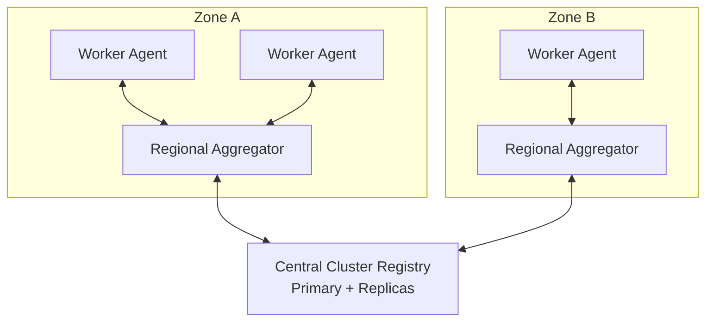
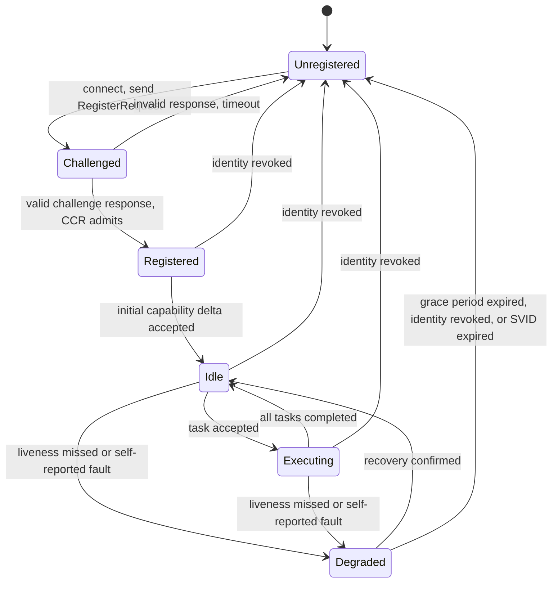

# a2a-control-plane Specification 02: Topology

**Status:** Draft v0.1.0  
**Scope:** Component boundaries, Worker Agent lifecycle, and message topic namespace.

## 1. Conventions

The key words "MUST", "MUST NOT", "REQUIRED", "SHALL", "SHALL NOT", "SHOULD", "SHOULD NOT", "RECOMMENDED", "NOT RECOMMENDED", "MAY", and "OPTIONAL" in this document are to be interpreted as described in BCP 14 ([RFC 2119], [RFC 8174]) when, and only when, they appear in all capitals.

## 2. Terminology

| Term | Definition |
|------|------------|
| **Central Cluster Registry** (CCR) | The single logical authority for agent identity, admission, and zone assignment. Replicated for availability (Primary/Replica). |
| **Regional Aggregator** (RA) | A per-zone component that terminates Worker connections, routes tasks, and aggregates state deltas. |
| **Worker Agent** (WA) | An agent process that executes tasks. |
| **Zone** | A failure and trust domain identified by `zone_id`. Each Worker belongs to exactly one zone. |
| **Delta** | A message carrying only changed state, as defined in [03-protocols](03-protocols.md). |

## 3. Topology Overview



The topology is a strict three-tier tree. Edges not shown above MUST NOT exist. In particular there is no Worker-to-Worker path and no Worker-to-Registry data path.

## 4. Interaction Boundaries

### 4.1 Central Cluster Registry

- The CCR MUST be the sole authority that admits Workers and Aggregators to the cluster.
- The CCR MUST maintain the authoritative mapping of `agent_id` to `zone_id` and to capability set.
- The CCR MUST run as one Primary and one or more Replicas. Only the Primary MAY accept writes. Replicas MUST serve reads and MUST be promotable without changing any identity.
- The CCR MUST NOT carry task payloads or per-task traffic.
- The CCR MUST communicate only with Regional Aggregators and administrative clients. It MUST NOT accept connections from Worker Agents, except for the single registration challenge exchange defined in Section 5.2, which MUST be proxied by the Aggregator.

### 4.2 Regional Aggregator

- Each zone MUST have at least one Aggregator and SHOULD have at least two for availability.
- An Aggregator MUST authenticate to the CCR with its own identity as defined in [01-identity](01-identity.md).
- An Aggregator MUST be the only component through which a Worker sends or receives traffic.
- An Aggregator MUST dispatch tasks only to Workers in its own zone.
- An Aggregator MUST forward state to the CCR as batched, coalesced deltas. It MUST NOT forward every Worker heartbeat individually.
- An Aggregator MUST reject any Worker whose presented identity does not match the zone it serves.
- An Aggregator MUST NOT originate tasks. Tasks originate from authorized clients through the CCR or from other authorized control components.

### 4.3 Worker Agent

- A Worker MUST maintain exactly one authenticated, long-lived connection, to an Aggregator of its own zone.
- A Worker MUST NOT open connections to other Workers.
- A Worker MUST NOT open connections to the CCR after registration completes.
- A Worker MUST publish only to subjects under its own `agent_id` and MUST subscribe only to its own `tasks` subject (Section 6).
- A Worker MUST report state changes as deltas and SHOULD NOT report unchanged state.

### 4.4 Summary Matrix

"Y" means the interaction is permitted. Every other interaction MUST NOT occur.

| From \ To | CCR | RA (own zone) | RA (other zone) | WA |
|-----------|-----|---------------|-----------------|----|
| **CCR** | n/a | Y | Y | N |
| **RA** | Y | n/a | N | Y (own zone) |
| **WA** | N | Y | N | N |

## 5. Worker Agent State Machine

### 5.1 States

| State | Meaning |
|-------|---------|
| `Unregistered` | The Worker has no valid registration. |
| `Challenged` | The Aggregator has issued a registration challenge and awaits a valid response. |
| `Registered` | The CCR has admitted the Worker and recorded its zone and capabilities. |
| `Idle` | The Worker is registered, healthy, and has no active task. |
| `Executing` | The Worker is processing at least one task. |
| `Degraded` | The Worker is reachable but unhealthy, or has missed liveness deadlines. |

### 5.2 Transitions



| # | From | To | Trigger | Required behavior |
|---|------|----|---------|-------------------|
| T1 | `Unregistered` | `Challenged` | Worker connects over mTLS and sends a registration request. | The Aggregator MUST generate a single-use nonce with at least 128 bits of entropy and MUST obtain the CCR's challenge. |
| T2 | `Challenged` | `Registered` | Worker returns a valid response to the challenge within the challenge timeout. | The CCR MUST verify the response against the Worker's identity, MUST record `agent_id`, `zone_id`, and capabilities, and MUST then confirm admission. |
| T3 | `Challenged` | `Unregistered` | Invalid response or timeout. | The Aggregator MUST close the connection. The nonce MUST be invalidated. |
| T4 | `Registered` | `Idle` | The CCR accepts the Worker's initial capability delta. | The Aggregator MUST begin subscribing the Worker to its `tasks` subject. |
| T5 | `Idle` | `Executing` | The Worker accepts a task. | The Worker MUST emit a state delta reflecting the change. |
| T6 | `Executing` | `Idle` | The last active task completes or is cancelled. | The Worker MUST emit a state delta reflecting the change. |
| T7 | `Idle` or `Executing` | `Degraded` | The Aggregator misses the Worker's liveness deadline (see [03-protocols](03-protocols.md)), or the Worker reports a fault. | The Aggregator MUST stop dispatching new tasks to the Worker and MUST report the change to the CCR. |
| T8 | `Degraded` | `Idle` | Liveness is restored and the Worker reports healthy. | The Aggregator MAY resume dispatch only after the CCR is notified. |
| T9 | `Degraded` | `Unregistered` | The recovery grace period expires. | The Aggregator MUST close the connection and the CCR MUST mark the Worker unregistered. Tasks assigned to the Worker MUST be reassigned or failed. |
| T10 | Any registered state | `Unregistered` | Identity revoked or SVID expired without renewal. | The Aggregator MUST close the connection immediately. |

Any transition not listed in the table MUST NOT occur. An implementation receiving an event that would cause an unlisted transition MUST ignore the event and SHOULD log it.

### 5.3 State Invariants

- A Worker MUST NOT receive tasks in any state other than `Idle` or `Executing`.
- The CCR MUST treat the Aggregator's view as authoritative for `Idle`, `Executing`, and `Degraded`, and MUST treat its own record as authoritative for `Unregistered`, `Challenged`, and `Registered`.
- The default challenge timeout SHOULD be 10 seconds. The default recovery grace period SHOULD be 120 seconds. Both MUST be configurable.

## 6. Message Topic Namespace

Asynchronous messages use a hierarchical, dot-delimited subject namespace, compatible with NATS subject syntax.

### 6.1 Subject Grammar

```
subject    = "a2a" "." scope
scope      = "zone" "." zone-id "." target
target     = "agent" "." agent-id "." channel / "aggregator" "." channel
channel    = "tasks" / "state" / "results" / "control"
zone-id    = token
agent-id   = token
token      = 1*( ALPHA / DIGIT / "-" / "_" )
```

- A token MUST NOT contain `.`, `*`, `>`, or whitespace.
- A token MUST be 1 to 64 characters.
- Subject names are case sensitive. Implementations SHOULD use lowercase.

### 6.2 Defined Subjects

| Subject | Direction | Purpose |
|---------|-----------|---------|
| `a2a.zone.<zone_id>.agent.<agent_id>.tasks` | Aggregator to Worker | Task dispatch to one Worker. |
| `a2a.zone.<zone_id>.agent.<agent_id>.state` | Worker to Aggregator | State deltas and heartbeats. |
| `a2a.zone.<zone_id>.agent.<agent_id>.results` | Worker to Aggregator | Task results. |
| `a2a.zone.<zone_id>.agent.<agent_id>.control` | Aggregator to Worker | Control commands (drain, shutdown). |
| `a2a.zone.<zone_id>.aggregator.state` | Aggregator to CCR | Coalesced zone state. |

### 6.3 Wildcard Subscription Rules

Wildcards follow NATS semantics: `*` matches exactly one token and `>` matches one or more trailing tokens.

| Subscriber | Permitted subscription |
|------------|------------------------|
| Worker | Only `a2a.zone.<own_zone_id>.agent.<own_agent_id>.tasks` and `.control`. A Worker MUST NOT use wildcards. |
| Aggregator | `a2a.zone.<own_zone_id>.agent.*.state`, `a2a.zone.<own_zone_id>.agent.*.results`. An Aggregator MUST NOT subscribe outside its own zone. |
| CCR | `a2a.zone.*.aggregator.state` and, for diagnostics only, `a2a.zone.>`. |

Examples:

- `a2a.zone.eu-west-1.agent.*.state` matches the state subject of every Worker in zone `eu-west-1`.
- `a2a.zone.*.agent.worker-7.tasks` is not permitted for any Worker, and for an Aggregator only if the zone token is its own.

The CCR MUST NOT publish to the regional bus; it communicates with Aggregators over gRPC ([03-protocols](03-protocols.md) Section 2).

### 6.4 Authorization Binding

- Subject permissions MUST be derived from the authenticated SPIFFE identity (see [01-identity](01-identity.md)), not from client-supplied claims.
- A publish or subscribe outside the permissions in Section 6.3 MUST be rejected, and the rejection SHOULD be logged and counted.
- The `zone_id` and `agent_id` tokens in a Worker's subjects MUST match the zone and agent components of its SPIFFE ID.

## 7. Conformance

An implementation conforms to this document if it satisfies every MUST and MUST NOT statement for each role it implements. Implementations SHOULD publish a conformance statement listing roles and optional features supported.

## 8. Security Considerations

- Removing Worker-to-Worker paths eliminates lateral movement between compromised Workers. Network enforcement is demonstrated in [`reference/k8s-network-isolation.yaml`](../reference/k8s-network-isolation.yaml).
- Subject-level authorization is REQUIRED because a flat subject space would otherwise allow impersonation.
- Replay of registration responses is prevented by single-use nonces and short challenge timeouts.

[RFC 2119]: https://www.rfc-editor.org/rfc/rfc2119
[RFC 8174]: https://www.rfc-editor.org/rfc/rfc8174
